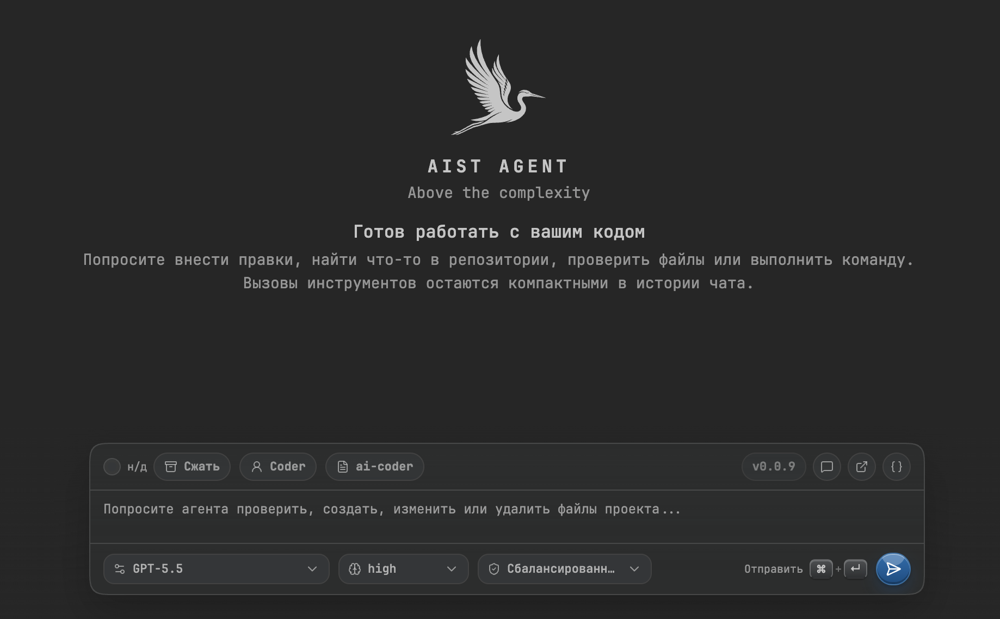

# aist

Minimal VS Code coding agent powered by OpenRouter or ChatGPT Codex.



[Русская документация](docs/ru/README.md) · [Full English documentation](docs/README.md)

## Install from GitHub

```bash
bash <(curl -fsSL https://raw.githubusercontent.com/stray-live-pixel/aist/main/scripts/install-from-github.sh)
```

For VS Code Insiders:

```bash
VSCODE_CLI=code-insiders bash <(curl -fsSL https://raw.githubusercontent.com/stray-live-pixel/aist/main/scripts/install-from-github.sh)
```

## Quick setup

Store an OpenRouter API key in the CLI/global secret store or provide it through the environment:

```bash
aist auth openrouter set-key
```

```json
{
  "openrouterAgent.model": "openai/gpt-4o-mini",
  "openrouterAgent.language": "en"
}
```

Alternatively, use ChatGPT Codex models after running `aist: Login ChatGPT Codex`.

## Core features

- Chat sidebar and editor chat panels inside VS Code.
- OpenRouter and ChatGPT Codex model support.
- Active editor file or selection is added as request context.
- Markdown answers with copy buttons.
- Workspace filesystem tools with per-tool approvals.
- Native VS Code diff preview before file edits.
- Agent modes, project instructions, custom skills, permissions, and chat compaction.

## Development

```bash
npm install
npm run build
npm run package
```

See [docs/README.md](docs/README.md) for detailed usage, configuration, development, and release notes.
